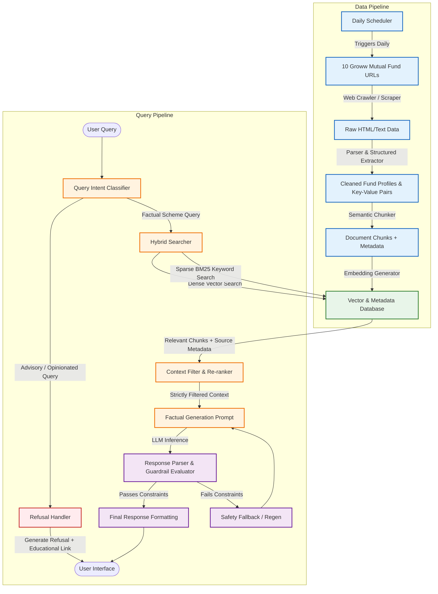

# Architecture Design: Mutual Fund FAQ Assistant (Facts-Only Q&A)

This document outlines the detailed architecture for the **Mutual Fund FAQ Assistant**, a RAG-based (Retrieval-Augmented Generation) application designed to answer facts-only queries about 10 selected ICICI Prudential mutual fund schemes. It ensures extreme accuracy, strict constraint compliance, and absolute avoidance of investment advice.

---

## 1. System Architecture Overview

The system follows a modular pipeline designed to ingest structured and unstructured mutual fund data, store it securely, route user queries based on safety guardrails, and generate factual responses that strictly respect the constraints.



---

## 2. Data Ingestion & Ingestion Pipeline

To deliver facts-only information, we must ingest, parse, and structure the data from the 10 Groww mutual fund URLs.

### A. Core Schemes Corpus
The assistant's knowledge base is strictly locked to the following 10 ICICI Prudential schemes:
1. Large Cap Fund
2. Commodities Fund
3. Balanced Advantage Fund
4. Liquid Fund
5. Flexicap Fund
6. Value Discovery Fund
7. Retirement Fund (Pure Equity Plan)
8. Multicap Fund
9. Indo Asia Equity Fund
10. Silver ETF Fund of Funds (FoF)

### B. Extraction Strategy
Mutual fund scheme data consists of both highly structured tabular data (Expense Ratio, Exit Load, Minimum SIP, Riskometer, Fund size / AUM) and unstructured narrative text (Fund Manager history, investment objective, tax implications).
- **Metadata Tagging**: Every parsed segment is tagged with:
  - `fund_name`: e.g., "ICICI Prudential Bluechip Fund"
  - `source_url`: The matching Groww link
  - `data_type`: `structure_numerical`, `fund_management`, `text_description`
  - `last_scraped_date`: Ingestion timestamp
- **Fund Manager Extraction**: Fund manager details (names, experience, active tenure) are extracted as distinct sub-blocks so they can be accurately correlated with the scheme.

### C. Pipeline Scheduling
To ensure the facts-only database remains up-to-date with any changes from the source websites (e.g., changes in key metrics like NAV or expense ratios), the data ingestion pipeline runs automatically on a scheduled daily trigger:
- **Daily Ingestion Trigger**: A background scheduler (such as a cron job, Celery beat, or serverless scheduled event) triggers the scraping pipeline once a day.
- **Change Detection & Database Refresh**: The pipeline scrapes the target URLs, compares the newly retrieved data with the existing records, and performs incremental updates to the Vector and Metadata Database if any modifications are detected.

---

## 3. Query Intent & Refusal Handler (Guardrails)

Before retrieving any context, the input query undergoes a strict safety check via the **Query Intent Classifier**.

```mermaid
flowchart TD
    Q[User Query] --> C{Is Query Advisory?}
    C -->|Yes: "Should I buy?", "Which is better?"| R[Refusal Prompt]
    C -->|No: "What is the exit load of X?"| V[Context Retrieval]
    
    R --> RF[Polite Refusal + Educational Link AMFI/SEBI]
    V --> CB[RAG Factual Generation]
```

### A. Refusal Rules
If the query asks for opinions, performance comparison, or buy/sell advice:
1. **Polite Refusal**: Standardized, friendly response explaining that the assistant is a factual tool and does not provide investment advice.
2. **Educational Redirection**: Appends an official link to resources like [AMFI India](https://www.amfiindia.com/) or [SEBI Investor](https://investor.sebi.gov.in/) to assist the user in learning how to evaluate funds.

> [!IMPORTANT]
> **Advisory Query Refusal Example:**
> - **Query**: *"Is ICICI Pru Large Cap Fund a buy right now?"*
> - **Response**: *"I cannot provide investment recommendations or opinions on whether to buy a fund. I am a facts-only assistant designed to answer objective queries. To learn more about evaluating mutual funds, please visit the official [AMFI Investor Education Page](https://www.amfiindia.com/investor-corner)."*

---

## 4. Retrieval & Search Layer

To prevent hallucinations, the retrieval layer strictly isolates data related to the specific fund mentioned in the query.

- **Entity Extraction**: Extract the fund name from the query (e.g., *"What is the exit load for the liquid fund?"* -> `ICICI Prudential Liquid Fund`).
- **Strict Metadata Filtering**: Apply a hard metadata filter to the Vector Database search. Only chunks matching the identified fund's `fund_name` are pulled.
- **Hybrid Retrieval**: Combine dense semantic retrieval (for natural language questions like *"Tell me about the experience of the manager of the value fund"*) and sparse keyword search (for exact metrics like *"minimum SIP"* or *"expense ratio"*).

---

## 5. LLM Generation Prompt & Constraint Enforcement

The LLM prompt is engineered to enforce compliance. The retrieved contexts are formatted clearly, and the instructions are written as a strict system contract.

### A. LLM Prompt Template
```text
System Role:
You are a highly precise, facts-only mutual fund assistant. You answer questions using ONLY the provided context. If the answer cannot be found in the context, politely state that you do not have that information.

Strict Output Rules:
1. Maximum length: 3 sentences. No exceptions.
2. Do not offer opinions, projections, or advice.
3. You must include exactly one citation link. Use the 'source_url' from the context.
4. Keep the response objective, neutral, and clear.
5. Do not calculate returns or make performance comparisons.
6. The footer must state: "Last updated from sources: <date>" where <date> is extracted from the context.

Context:
[Retrieved Context Blocks with metadata]

User Query:
{query}
```

### B. Output Validator & Post-Processor
A post-processing module validates the generated response against these rules before showing it to the user:
- **Sentence Count Checker**: Splits text into sentences and checks if the count is $\le 3$.
- **Citation Matcher**: Verifies that exactly one Groww link is present and that it matches the source URL of the retrieved context.
- **Advice Filter**: Uses a regex / mini-classifier to flag words like "should", "recommend", "best", "great", "better", "buy", "sell".

---

## 6. User Interface Design

The frontend UI will be a premium, responsive conversational interface built with maximum visual feedback.

### A. Key Components
1. **Interactive Sidebar**: Contains a persistent, prominent disclaimer:
   > ⚠️ **Disclaimer: Facts-only. No investment advice.**
2. **Dynamic Chat Area**: A beautifully aligned, clean conversation layout.
3. **Quick-Start Prompts**: Three sample factual questions (e.g., *"What is the exit load of the Liquid Fund?"*, *"Who manages the Bluechip Fund?"*).
4. **Citation Cards**: Responses display the citation link as a beautifully rendered card containing the source Groww icon and title, instead of a raw text link.

---

## 7. Setup & Implementation Steps

To implement this architecture:
1. **Setup Scraper**: Build a Node/Python scraper using tools like `Playwright` or `BeautifulSoup` to pull direct metrics and text data from the 10 Groww URLs.
2. **Chunk & Load**: Chunk the data semantically and push it to a local index/store (e.g., `LangChain` + `ChromaDB` / `FAISS` or simple in-memory key-value vector indices).
3. **Build Backend**: A lightweight Node.js/Python server that connects to the **Groq API** (using high-speed models like Llama 3) and runs the intent guardrail.
4. **Build Frontend**: Responsive premium dashboard with animations, theme control (glassmorphism/dark mode), and absolute visual clarity.
5. **Configure Scheduler**: Implement a daily cron job, GitHub Action, or task scheduler (like Celery Beat or AWS EventBridge) to trigger the scraping and indexing pipeline automatically once a day.
