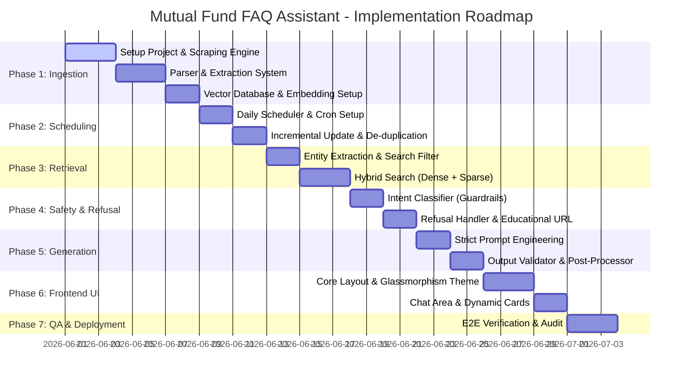

# Phase-Wise Implementation Plan: Mutual Fund FAQ Assistant (Facts-Only Q&A)

This document provides a highly detailed, phase-wise implementation roadmap for building the **Mutual Fund FAQ Assistant**. It translates the constraints and requirements from the [Problem Statement](file:///c:/Users/Ashish%20Bhardwaj/Downloads/MutualFundsProject/docs/problemStatement.md) and the [Architecture Design](file:///c:/Users/Ashish%20Bhardwaj/Downloads/MutualFundsProject/docs/architecture.md) into concrete, sequential development phases.

---

## Plan Overview & Sequential Timeline

---

## Detailed Phase Breakdown

### Phase 1: Project Setup & Scraping Engine (Ingestion Pipeline)
**Objective**: Build a robust, modular crawler to parse structure and unstructured content from the 10 Groww mutual fund URLs, chunk them semantically, and load them into a secure vector store.

#### Technical Tasks
- [x] Initialize project repository (Node.js/TypeScript or Python workspace).
- [x] Implement a resilient web crawler utilizing `Playwright` or `BeautifulSoup` to scrape the 10 target Groww URLs.
- [x] Develop a custom **Parser & Structured Extractor** to extract:
  - Numerical parameters: Expense Ratio, Exit Load, Minimum SIP, Lock-in period, Riskometer category, Fund size (AUM).
  - Textual parameters: Investment Objective, Benchmark index, Fund Manager names, experience, and active tenure.
- [x] Attach structured metadata tags (`fund_name`, `source_url`, `data_type`, `last_scraped_date`) to each chunk.
- [x] Implement a **Semantic Chunker** that splits narrative text into coherent paragraphs without losing context (e.g., grouping manager bios together).
- [x] Configure `ChromaDB` as the secure local vector index, generating embeddings with local BGE-Small (`BAAI/bge-small-en-v1.5`) model.

#### Deliverables
* Crawler module: `src/ingestion/scraper.py` (or `.ts`)
* Parser & chunker: `src/ingestion/parser.py`
* Embedding & loading script: `src/ingestion/embedder.py`
* Populated Local Vector Database holding parsed data for the 10 schemes.

#### Verification Strategy
* Run automated unit tests to assert that parsed schemes output exactly 10 distinct `fund_name` identifiers.
* Validate database entries: verify that embeddings and metadata fields (`fund_name`, `source_url`, `data_type`, `last_scraped_date`) are successfully populated.

---

### Phase 2: Pipeline Scheduling & Database Refresh
**Objective**: Automate the ingestion pipeline to keep the vector database up-to-date with daily changes (like NAV fluctuations or manager shifts) without manual intervention.

#### Technical Tasks
- [x] Set up a **Daily Scheduler** utility using a lightweight scheduler library (e.g., `APScheduler` in Python, standard Cron jobs, or serverless cloud schedulers).
- [x] Implement an **Incremental Update** flow inside the scraping engine:
  - Scrape page headers / quick parameters first to determine if updates exist.
  - Compare scraped data hashes against active vector database hashes.
- [x] Perform database refresh logic:
  - If updates are detected, remove existing vectors associated with the updated scheme `fund_name`.
  - Re-ingest, re-chunk, and re-embed the updated page contents.
  - Ensure the `last_scraped_date` metadata field gets refreshed to the current date/time.

#### Deliverables
* Scheduler utility module: `src/ingestion/scheduler.py`
* Change-detection and database refresh helper methods.
* Setup scripts for OS-level task scheduling (e.g., cron / Windows Task Scheduler).

#### Verification Strategy
* Run the scheduler with a 1-minute interval locally to ensure it triggers correctly.
* Mock a changed Groww metric, trigger the scheduling agent, and verify that the corresponding vector database chunks are updated and metadata reflects the new `last_scraped_date` timestamp.

---

#### Phase 3: RAG Retrieval & Hybrid Search Layer
**Objective**: Build a highly accurate retrieval layer that guarantees strict search confinement (no fund bleed) and uses hybrid search (vector similarity + BM25 keyword matching) to query structural parameters.

#### Technical Tasks
- [x] Develop a **Query Analyzer & Entity Extractor** in `src/retrieval/query_analyzer.py` utilizing a comprehensive keyword mapping dictionary (`SCHEME_REGISTRY`) that resolves colloquial inputs (e.g., "liquid", "bluechip", "multicap") to exact database `fund_name` strings.
- [x] Enforce **Strict Metadata Filtering** at the vector database query stage by injecting `where={"fund_name": target_fund_name}` into ChromaDB queries, ensuring absolute 0% fund bleed.
- [x] Construct a **Hybrid Searcher** in `src/retrieval/hybrid_search.py` that executes:
  - **Dense Vector Search**: BGE-Small embeddings cosine similarity querying via ChromaDB.
  - **Sparse Keyword Search**: A local document-level BM25 search (e.g., using `rank_bm25` or customized TF-IDF BM25 scoring) on the filtered fund's 3 active chunks.
- [x] Implement **Reciprocal Rank Fusion (RRF)** to merge dense and sparse rankings using standard formula $1 / (60 + r(d))$.
- [x] Create an **Intent-Based Boost Re-ranker** that inspects query text for specific categories (e.g., "manager", "expense", "exit load", "objective") and applies a deterministic booster score (+1.0 RRF) to put the correct chunk type at Rank 1.
- [x] Establish **Edge Case Handlers** for queries lacking specific fund entities (prompting a UI choice or returning a clarifying list) and factual multi-fund queries (extracting multiple entities and executing parallel queries).

#### Deliverables
* Search router & query analyzer: `src/retrieval/query_analyzer.py`
* Vector-sparse hybrid searcher: `src/retrieval/hybrid_search.py`
* Automated retrieval tests: `tests/test_retrieval.py`

#### Verification Strategy
* Run automated retrieval assertion tests to verify:
  * **Zero Fund Bleed**: A query for "exit load of Liquid Fund" yields only Liquid Fund context blocks.
  * **Deterministic Boosting**: A query about manager experience puts the `fund_management` chunk at Rank 1.
  * **Multi-entity Parsing**: A query about both Flexicap and Multicap yields chunks from both.
  * **Edge Case Fallback**: Query for "minimum SIP" without a fund name returns a clean request for clarification.

---

### Phase 4: Intent Classifier & Refusal Handler (Guardrails)
**Objective**: Protect the application from giving investment opinions or comparing funds by routing queries through a strict classification check.

#### Technical Tasks
- [x] Implement a high-speed **Query Intent Classifier** that analyzes incoming queries and classifies them into:
  - `FACTUAL`: Seeking direct, objective, and verifiable parameters.
  - `ADVISORY`: Requesting performance opinions, projections, comparisons, or recommendations (e.g., "should I invest", "which is best", "better performance").
- [x] Create a **Refusal Handler** module to handle `ADVISORY` queries:
  - Generate a polite, standardized disclaimer response.
  - Append the appropriate official educational resources (e.g., [AMFI India](https://www.amfiindia.com/) or [SEBI Investor](https://investor.sebi.gov.in/)).
- [x] Implement hard keyword-blocking triggers (e.g., regex checks for words like "recommend", "best", "great", "better", "buy", "sell", "compare").

#### Deliverables
* Intent classifier middleware: `src/guardrails/classifier.py`
* Refusal responses & links mapping config: `src/guardrails/refusal_config.json`

#### Verification Strategy
* Run automated test cases with critical inputs (e.g., *"Is Bluechip Fund a buy?"*, *"Which fund is better between large cap and multicap?"*) and verify that the system returns the refusal output and SEBI/AMFI educational links.
* Check response times of the intent classifier middleware to ensure low-latency overhead (< 200ms).

---

### Phase 5: Generation & Post-Validation Constraints
**Objective**: Program the LLM prompt to answer strictly using retrieved context via the **Groq API**, and build a programmatic validator to enforce format compliance.

#### Technical Tasks
- [ ] Connect the generation pipeline to the **Groq API** (utilizing models like Llama 3 for high-speed inference).
- [ ] Design and refine the **Factual Generation Prompt**:
  - Inject retrieved facts as absolute rules.
  - Instruct the model to strictly fail/refuse if context is missing (*"I do not have that information"*).
  - Enforce the 3-sentence maximum restriction in system guidelines.
- [ ] Implement the programmatic **Output Validator & Post-Processor**:
  - **Sentence Count Checker**: Split responses into sentences and raise an exception / force regeneration if length > 3 sentences.
  - **Citation Validator**: Verify that exactly one Groww scheme URL is included and that it matches the source of the retrieved contexts.
  - **Footer Checker**: Ensure the footer follows the layout: `Last updated from sources: <date>`.
  - **Advice Filtering**: Scan the generated output for advisory keywords as a final safety fallback.

#### Deliverables
* RAG generation core: `src/generation/generator.py`
* Output validation middleware: `src/generation/validator.py`

#### Verification Strategy
* Execute 50 RAG generations, validating that 100% of responses contain $\le 3$ sentences, exactly 1 citation matching the source URL, and the correct date footer format.
* Assert that queries for which the system has no context result in polite refusal (e.g., *"I do not have that information based on the official sources provided."*).

---

### Phase 6: Conversational UI & Premium Frontend
**Objective**: Build a highly engaging, visually excellent interface styled with modern aesthetics, providing complete transparency and clear compliance features.

#### Technical Tasks
- [ ] Set up a premium frontend SPA (Single Page Application) using `React/Next.js` or standard fast HTML + CSS frameworks.
- [ ] Implement the **Premium Theme Design**:
  - Custom harmonious dark mode & glassmorphism theme using styled CSS (harmonious HSL colors, smooth box-shadows, premium Google Fonts).
  - Micro-animations for buttons, loading states, and chat bubbles to make the UI feel alive.
- [ ] Add the **Interactive Sidebar** component:
  - Feature a persistent, high-visibility warning block: **⚠️ Disclaimer: Facts-only. No investment advice.**
  - Provide a checklist of the 10 eligible schemes so the user knows the exact domain boundaries.
- [ ] Design the **Dynamic Chat Area**:
  - Align user and assistant chat bubbles beautifully.
  - Add **Quick-Start Prompt Pills** (three factual questions that populate the input field automatically).
  - Implement **Citation Cards** below the answers: Instead of raw hyperlinks, render a clickable card with an icon and the clean scheme title.
- [ ] Implement high-visibility disclaimers on input entry fields.

#### Deliverables
* Responsive frontend codebase (HTML/JS/CSS or SPA package) in `src/frontend/`
* UI component files: `Sidebar`, `ChatContainer`, `ChatBubble`, `CitationCard`, `DisclaimerBox`

#### Verification Strategy
* Test layout responsiveness on Desktop, Tablet, and Mobile Viewports.
* Verify interactive state animations (button hovers, loading skeleton, card transitions).
* Confirm that clicking quick-start pills triggers accurate, compliant answers.

---

### Phase 7: Integration, Testing & Compliance Audit
**Objective**: Conduct thorough end-to-end testing, security screening, and regulatory compliance checks to prepare the application for deployment.

#### Technical Tasks
- [ ] **E2E Integration**: Connect Frontend UI, Intent Classifiers, Hybrid Search, LLM Generation, Post-Processor, and Vector DB.
- [ ] **Privacy Audit**: Ensure that *no* user data such as PAN cards, Aadhaar, bank accounts, or names are saved, logged, or sent to external models. Create an absolute data scrub middleware for query logging.
- [ ] **RAG Quality Evaluation**: Establish a validation dataset containing 30 factual questions and 20 advisory questions. Run automated evaluations:
  - Refusal Accuracy (Advisory query refusal rate must be 100%).
  - Citation Accuracy (Must match ground truth source URL 100% of the time).
  - Semantic Accuracy (Response must contain no hallucinations).
- [ ] **Error Handling & Resilience**:
  - Implement fallback handling for database connection drops, API timeouts, or prompt generation errors.

#### Deliverables
* Integrated production build configs.
* Privacy validation and query scrubbing layer: `src/utils/scrubber.py`
* Test suite report: `tests/e2e_rag_evaluation.json`

#### Verification Strategy
* Execute standard Python `pytest` or Node `jest` E2E test runs.
* Verify the pipeline handles simulated network outages gracefully by displaying a localized error message without spilling backend details.

---

## Technical Architecture Mapping & Constraint Compliance

| Constraint (from docs/problemStatement.md) | Architectural Solution (from docs/architecture.md) | Validation & Testing Strategy |
| :--- | :--- | :--- |
| **Facts-Only Retrieval & Isolation** | Strict entity extraction and metadata schema hard filter (`fund_name`). | Test search queries to ensure context from scheme A never bleeds into scheme B. |
| **Max 3-Sentence Response Limit** | Post-processing validator + sentence length parser/tokenizer checks. | Post-processor rejects and prompts regeneration/truncation if sentences > 3. |
| **Single, Clear Citation Link** | Citation Matcher validating exactly one matching Groww source URL. | Assert regex check matches exactly 1 hyperlink that matches source context. |
| **Last Scraped Date Footer** | Ingestion pipeline tracks `last_scraped_date` metadata. | Assert footer contains exact matching date pattern from database. |
| **Strict Advisory Refusal** | Query Intent Classifier + Refusal Handler with educational AMFI/SEBI redirection. | Advisory questions dataset executed; verify refusal responses trigger 100%. |
| **Zero Sensitive Data Collection** | Backend data scrubber middleware scrubbing PAN, Aadhaar, emails, OTPs. | Assert logging files are fully scrubbed of simulated PII metrics. |
| **Persistent Compliance Disclaimer** | High-visibility sidebar warning + disclaimer input tags in Frontend layout. | Manual visual check on desktop and mobile layout. |
