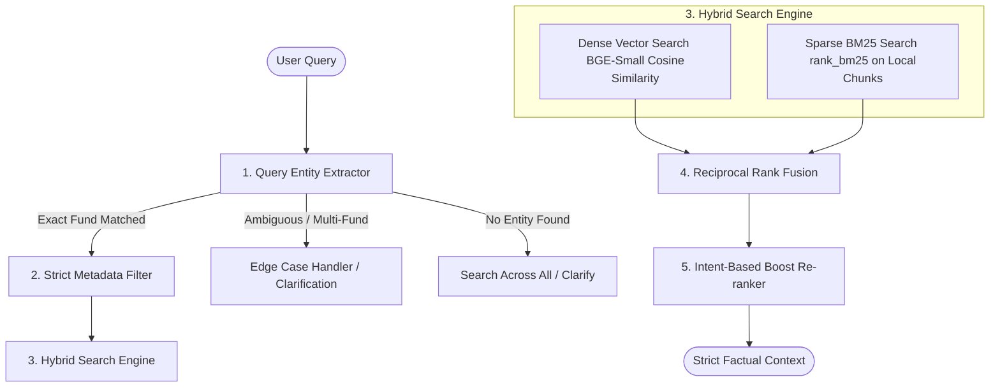

# Phase 3: RAG Retrieval & Hybrid Search Strategy

This document specifies the technical design, algorithms, and retrieval strategy for **Phase 3 (RAG Retrieval & Hybrid Search Layer)** of the **Mutual Fund FAQ Assistant**. 

Given the nature of our database (exactly 3 semantic chunks per mutual fund scheme across 10 total schemes, creating a highly concentrated corpus of ~30 documents), our strategy is designed to achieve **zero fund bleed**, **100% precise keyword correlation**, and **optimal LLM context formatting**.

---

## 1. Corpus Analysis & Retrieval Constraints

Our database contains three distinct types of chunks per fund, structured via the `SemanticChunker` in [parser.py](file:///c:/Users/Ashish%20Bhardwaj/Downloads/MutualFundsProject/src/ingestion/parser.py):

| Chunk Data Type | Description / Key Fields | Dominant Query Patterns |
| :--- | :--- | :--- |
| **`structure_numerical`** | NAV, AUM (Fund Size), Expense Ratio, Exit Load, Minimum SIP, Lock-in Period, Riskometer, Benchmark. | *"What is the exit load?"*, *"minimum SIP"*, *"expense ratio of liquid fund"* |
| **`text_description`** | Narrative Investment Objective. | *"What is the objective of this fund?"*, *"what is the strategy?"* |
| **`fund_management`** | Fund Manager names, total experience, active tenure sub-blocks. | *"Who manages the flexicap fund?"*, *"experience of Mr. X"* |

### The "Small Corpus" Advantage & Hallucination Risk
Since each fund has only **3 chunks**, the total retrieval scope per query is exceptionally small. Rather than worrying about filtering down thousands of documents, our retrieval challenge centers on:
1. **Absolute Anti-Bleed Isolation**: Under no circumstances should context from "Fund A" bleed into the prompt when a user asks about "Fund B".
2. **Key-Value Precision**: Small semantic differences in dense vector embeddings can cause a semantic search to miss precise numerical tables. For example, a query asking for "exit load" must prioritize the numerical summary chunk over narrative management bios.

---

## 2. Retrieval Strategy Architecture

The proposed Phase 3 query pipeline processes incoming queries through a four-stage system before generation:



---

## 3. Step-by-Step Implementation Details

### Step 1: Query Entity Extractor (Anti-Bleed Router)
To guarantee strict search confinement, we map colloquial queries to the exact database `fund_name` using a robust, keyword-matching registry:

```python
SCHEME_REGISTRY = {
    "ICICI Prudential Large Cap Fund Direct Growth": [
        "large cap", "bluechip", "largecap", "blue chip"
    ],
    "ICICI Prudential Commodities Fund Direct Growth": [
        "commodities", "commodity", "metals"
    ],
    "ICICI Prudential Equity & Debt Fund Direct Growth": [
        "balanced", "balanced advantage", "equity & debt", "equity and debt"
    ],
    "ICICI Prudential Liquid Fund Direct Plan Growth": [
        "liquid"
    ],
    "ICICI Prudential Flexicap Fund Direct Growth": [
        "flexicap", "flexi cap"
    ],
    "ICICI Prudential Value Direct Growth": [
        "value", "value discovery"
    ],
    "ICICI Prudential Retirement Fund Pure Equity Plan Direct Growth": [
        "retirement", "pure equity plan"
    ],
    "ICICI Prudential Multicap Fund Direct Plan Growth": [
        "multicap", "multi cap"
    ],
    "ICICI Prudential Indo Asia Equity Fund Direct Growth": [
        "indo asia", "indo-asia"
    ],
    "ICICI Prudential Silver ETF FoF Direct Growth": [
        "silver", "silver etf", "silver fof"
    ],
    "ICICI Prudential Smallcap Fund Direct Plan Growth": [
        "smallcap", "small cap"
    ]
}
```

#### Extraction Algorithm
1. Normalize query to lowercase.
2. Scan the query for keywords in `SCHEME_REGISTRY`.
3. If an exact match is found, route search to that specific `fund_name`.
4. If multiple schemes match (e.g., *"Compare flexicap and multicap"*), flags a multi-entity condition.
5. If zero schemes match, proceed with a wide search but trigger the safety classifier to check if the query is out-of-scope.

---

### Step 2: Strict Metadata Filtering
Once the target scheme is identified, we enforce isolated search by passing a metadata filter dictionary to ChromaDB:

```python
# Force ChromaDB to only search within chunks belonging to the identified scheme
where_filter = {"fund_name": target_fund_name}
```

This ensures that **0% fund bleed** occurs. Even if a different fund contains semantically highly similar words, the vector store completely ignores them.

---

### Step 3: Hybrid Search (Dense + Sparse BM25)
Dense vector search can occasionally miss specific jargon terms (like "SIP" or "AUM") if they are embedded near other numeric descriptors. We combine BGE-Small dense retrieval with a local **BM25** implementation:

1. **Dense Query**:
   ```python
   dense_results = collection.query(
       query_texts=[query],
       n_results=3,
       where=where_filter
   )
   ```
2. **Sparse BM25 Query**:
   - Tokenize the documents associated with the filtered fund.
   - Fit a `BM25Okapi` model on the 3 chunks.
   - Score and rank the 3 chunks based on word overlap.

---

### Step 4: Reciprocal Rank Fusion (RRF)
To merge the dense and sparse search rankings without arbitrary score scaling issues, we compute the RRF score for each chunk:

$$RRF\_Score(d) = \frac{1}{60 + Rank_{dense}(d)} + \frac{1}{60 + Rank_{sparse}(d)}$$

The chunk with the highest RRF score is placed first in the context array.

---

### Step 5: Intent-Based Boost Re-ranker (Deterministic Safety)
Since a single fund has only **3 chunks**, we can introduce a bulletproof rule-based booster that parses the query for key intent markers and ensures the 100% correct chunk occupies the prime position (`Rank 1`):

```python
INTENT_KEYWORDS = {
    "structure_numerical": [
        "expense", "ratio", "exit", "load", "minimum", "sip", 
        "lock-in", "lock in", "riskometer", "benchmark", "nav", 
        "aum", "size", "cr", "charges", "fees", "cost"
    ],
    "fund_management": [
        "manager", "run by", "experience", "tenure", "managed by", 
        "names", "sharmila", "darshil", "nikhil", "goswami", "naren"
    ],
    "text_description": [
        "objective", "aim", "goal", "invests in", "strategy", 
        "purpose", "description", "details"
    ]
}
```

#### Re-ranking Logic
- Scan the query for keywords in each bucket.
- If keywords from `structure_numerical` match, apply a **+1.0 RRF booster score** to the `structure_numerical` chunk.
- If keywords from `fund_management` match, apply a **+1.0 RRF booster score** to the `fund_management` chunk.
- If keywords from `text_description` match, apply a **+1.0 RRF booster score** to the `text_description` chunk.

This guarantees that if the user asks *"Who manages the liquid fund?"*, the managers' bio is deterministically placed first, while the numbers chunk is placed second, providing a highly optimized context flow to the LLM.

---

## 4. Resolving Critical Edge Cases

### Edge Case A: Query Lacks Fund Entity (e.g., *"What is the minimum SIP?"*)
- **Risk**: Searching across all 10 funds might bleed all 10 minimum SIPs into the prompt, resulting in a cluttered or hallucinated answer.
- **Decision**: 
  1. Trigger an interactive clarification in the UI by presenting the 10 fund options.
  2. In the API layer, return a polite fallback: *"Please specify which mutual fund scheme you are interested in. I can provide the minimum SIP for any of our 10 ICICI Prudential schemes."*

### Edge Case B: Multi-Fund Query / Comparison (e.g., *"Compare Flexicap and Multicap expense ratios"*)
- **Risk**: Comparing performance violates our strict advisory/comparison constraints.
- **Decision**: 
  - If the query contains comparative advisory markers, trigger the Refusal Handler (Phase 4).
  - If the query is strictly factual (e.g., *"What are the expense ratios of the Flexicap and Multicap funds?"*), extract both entities, apply a metadata filter for **both** funds (retrieving their respective `structure_numerical` chunks), and present the data strictly side-by-side without drawing qualitative conclusions.

---

## 5. Verification & Testing Strategy

To verify this retrieval strategy, we will run the following tests in Phase 3:
1. **Assertion Test - Zero Bleed**: Query *"exit load of Liquid Fund"* and assert that *zero* chunks belonging to the *Large Cap Fund* are present in the returned context.
2. **Assertion Test - Re-ranker Accuracy**: Query *"Who is the manager of Value fund"* and assert that the first chunk in the context list has `data_type == "fund_management"`.
3. **Accuracy Benchmark**: Run a test suite of 50 varied queries to check that the correct chunk type is retrieved as the primary context with 100% accuracy.
